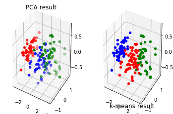
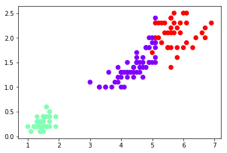
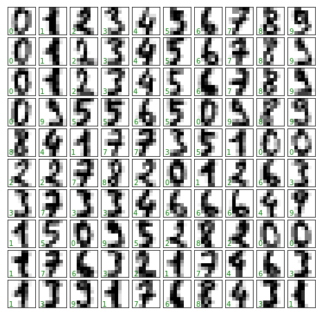
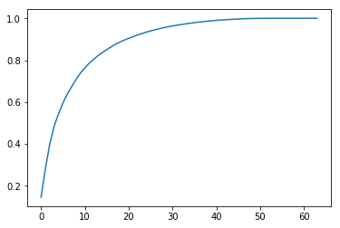
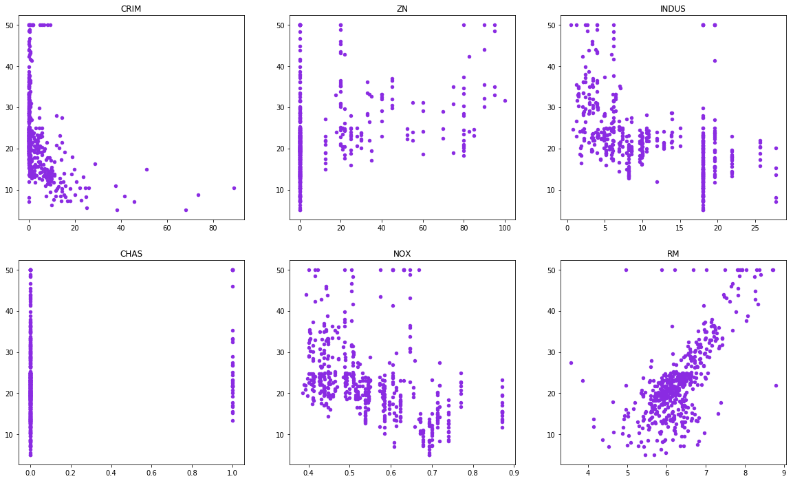
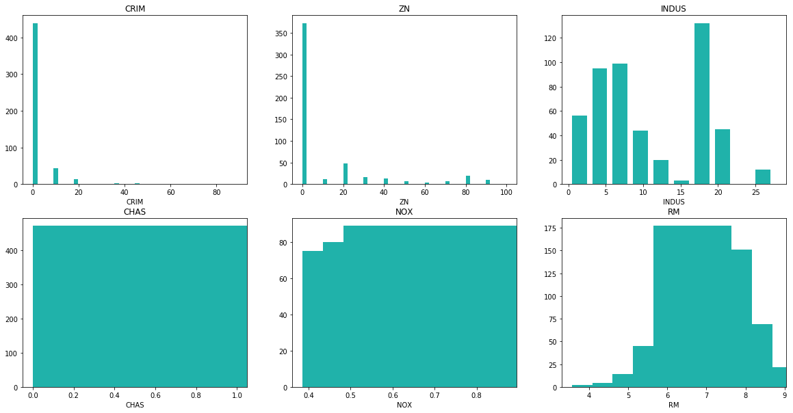
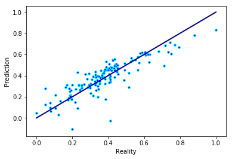

以下数据集均可通过导入sklearn.datasets获得
* 实现鸢尾花数据集kmeans聚类并用散点图展示；使用PCA将鸢尾花数据集降到2维并用散点图展示


```python
#coding=utf-8
import matplotlib.pyplot as plt
from sklearn.decomposition import PCA
from sklearn.datasets import load_iris
from mpl_toolkits.mplot3d import Axes3D
from sklearn.cluster import KMeans
import numpy as np


##计算欧式距离
def distEuclid(x, y):
    return np.sqrt(np.sum((x - y) ** 2))


##随机产生n个dim维度的数据 (这里为了展示结果 dim取2或者3)
def genDataset(n, dim):
    data = []
    while len(data) < n:
        p = np.around(np.random.rand(dim) * size, decimals=2)
        data.append(p)
    return data


## 初始化簇中心点 一开始随机从样本中选择k个 当做各类簇的中心
def initCentroid(data, k):
    num, dim = data.shape
    centpoint = np.zeros((k, dim))
    l = [x for x in range(num)]
    np.random.shuffle(l)
    for i in range(k):
        index = int(l[i])
        centpoint[i] = data[index]
    return centpoint


##进行KMeans分类
def KMeans(data, k):
    ##样本个数
    num = np.shape(data)[0]

    ##记录各样本 簇信息 0:属于哪个簇 1:距离该簇中心点距离
    cluster = np.zeros((num, 2))
    cluster[:, 0] = -1

    ##记录是否有样本改变簇分类
    change = True
    ##初始化各簇中心点
    cp = initCentroid(data, k)

    while change:
        change = False

        ##遍历每一个样本
        for i in range(num):
            minDist = 9999.9
            minIndex = -1

            ##计算该样本距离每一个簇中心点的距离 找到距离最近的中心点
            for j in range(k):
                dis = distEuclid(cp[j], data[i])
                if dis < minDist:
                    minDist = dis
                    minIndex = j

            ##如果找到的簇中心点非当前簇 则改变该样本的簇分类
            if cluster[i, 0] != minIndex:
                change = True
                cluster[i, :] = minIndex, minDist

        ## 根据样本重新分类  计算新的簇中心点
        for j in range(k):
            pointincluster = data[[x for x in range(num) if cluster[x, 0] == j]]
            cp[j] = np.mean(pointincluster, axis=0)

    print("finish!")
    return cp, cluster


##展示结果  各类簇使用不同的颜色  中心点使用X表示
def Show(data, k, cp, cluster):
    num, dim = data.shape
    color = ['b', 'r', 'g', 'c', 'y', 'm', 'k']
    ##二维图
    if dim == 2:
        for i in range(num):
            mark = int(cluster[i, 0])
            plt.plot(data[i, 0], data[i, 1], color[mark] + 'o')

        for i in range(k):
            plt.plot(cp[i, 0], cp[i, 1], color[i] + 'x')
    ##三维图
    elif dim == 3:
        ax = plt.subplot(122, projection='3d')
        for i in range(num):
            mark = int(cluster[i, 0])
            ax.scatter(data[i, 0], data[i, 1], data[i, 2], c=color[mark])
            ax.set_title('k-means result')
        for i in range(k):
            ax.scatter(cp[i, 0], cp[i, 1], cp[i, 2], c=color[i], marker='x')

    plt.show()
if __name__ == "__main__":
        data = load_iris()#以字典形式加载鸢尾花数据集
        y = data.target #使用y表示数据集中的标签
        x = data.data #使用x表示数据集中的属性数据
        #使用PCA 算法，设置降维后主成分数目为 2
        #print(x,'\n', y)
        #print(x)
        #print(type(x))
        size = 20  ##取值范围
        pca = PCA(n_components=3)
        #对原始数据进行降维，保存在 reduced_X 中
        reduced_X = pca.fit_transform(x)
        # print('降维后的数据为:\n',reduced_X)#降维后的数据
        print('各主成分方差解释度为：',pca.explained_variance_ratio_)#方差解释度
        print('主成分对应的载荷矩阵为',pca.components_)
        red_x, red_y , red_z = [], [],[]
        blue_x, blue_y , blue_z= [], [],[]
        green_x, green_y, green_z=[],[],[]

        for i in range(len(reduced_X)):
            #标签为0时，3维标签数据保存到列表red_x,red_y,redz中
            if y[i] == 0:
                red_x.append(reduced_X[i][0])
                red_y.append(reduced_X[i][1])
                red_z.append(reduced_X[i][2])#
            elif y[i] == 1:
                blue_x.append(reduced_X[i][0])
                blue_y.append(reduced_X[i][1])
                blue_z.append(reduced_X[i][2])#
            else:
                green_x.append(reduced_X[i][0])
                green_y.append(reduced_X[i][1])
                green_z.append(reduced_X[i][2])#
        X = reduced_X[:, :3]  # #表示我们取特征空间中的3个维度
       #print(X.shape)
       #print(X)
       #print(type(X))
        num = 50 ##点个数
        k=3 ##分类个数
        data = X
        cp,cluster = KMeans(data,k)
        ax=plt.figure().add_subplot(121,projection='3d')
        ax.scatter(red_x, red_y,red_z,c='r', marker='o')
        ax.scatter(blue_x, blue_y,blue_z,c='b', marker='o')
        ax.scatter(green_x, green_y,green_z,c='g', marker='o')#散点图中用s，其余图用markersize可调节散点的大小
        ax.set_title('PCA result')
        Show(data,k,cp,cluster)
```

    各主成分方差解释度为： [0.92461872 0.05306648 0.01710261]
    主成分对应的载荷矩阵为 [[ 0.36138659 -0.08452251  0.85667061  0.3582892 ]
     [ 0.65658877  0.73016143 -0.17337266 -0.07548102]
     [-0.58202985  0.59791083  0.07623608  0.54583143]]
    finish!





```python
from sklearn.datasets import load_iris
from sklearn.cluster import KMeans
import matplotlib.pyplot as plt
 
# 导入鸢尾花数据集
iris = load_iris()
# 鸢尾花花瓣长度数据
x = iris.data
# 构建模型
model = KMeans(n_clusters=3)
# 训练
model.fit(x)
# 预测
y = model.predict(x)
print("预测结果：", y)
#画图
plt.scatter(x[:, 2], x[:, 3], c=y, s=50, cmap='rainbow')
plt.show()
```

    预测结果： [1 1 1 1 1 1 1 1 1 1 1 1 1 1 1 1 1 1 1 1 1 1 1 1 1 1 1 1 1 1 1 1 1 1 1 1 1
     1 1 1 1 1 1 1 1 1 1 1 1 1 0 0 2 0 0 0 0 0 0 0 0 0 0 0 0 0 0 0 0 0 0 0 0 0
     0 0 0 2 0 0 0 0 0 0 0 0 0 0 0 0 0 0 0 0 0 0 0 0 0 0 2 0 2 2 2 2 0 2 2 2 2
     2 2 0 0 2 2 2 2 0 2 0 2 0 2 2 0 0 2 2 2 2 2 0 2 2 2 2 0 2 2 2 0 2 2 2 0 2
     2 0]





---
* 实现鸢尾花数据集knn分类，并计算正确率（每类中各取20个测试）


```python
import pandas as pd
from sklearn.datasets import load_iris
#(1)加载莺尾花数据集
iris = load_iris()
X = iris.data
y = iris.target
# (2)分割数据
from sklearn.model_selection import train_test_split
X_train, X_test, y_train, y_test = train_test_split(X, y, test_size = 0.3, random_state = 123)
#(3)选择模型
from sklearn.neighbors import KNeighborsClassifier
#(4)生成模型对象
knn = KNeighborsClassifier(n_neighbors = 3)
#(5)训练模型(数据拟合)
knn.fit (X, y)
#(6)模型预测
#(6)-A单个数据预测
knn.predict ([[4,3,5,3]]) #输出 array( [2 ])
#(6)-B大集合数据预测
y_predict_on_train = knn.predict(X_train)
y_predict_on_test = knn.predict(X_test)
#(7)模型评估
from sklearn.metrics import accuracy_score
print("训练集的准确率为：{:.2f}%".format (100 * accuracy_score (y_train[:20], y_predict_on_train[:20])))
print("测试集的准确率为：{:.2f}%".format (100 * accuracy_score (y_test[:20], y_predict_on_test[:20])))
```

    训练集的准确率为：100.00%
    测试集的准确率为：95.00%


---
* 对MNIST手写数字数据集使用knn分类，计算正确率；先对MNIST手写数字数据集用PCA降维，选择合适的维数，再使用knn分类，比较两者识别率；


```python
import numpy as np
import matplotlib.pyplot as plt
from sklearn import datasets

digits = datasets.load_digits() # 加载数据

digits.images.shape

# 绘制坐标轴
fig, axes = plt.subplots(10,10, figsize=(8, 8),subplot_kw={'xticks':[], 'yticks':[]},
                        gridspec_kw=dict(hspace=0.1, wspace=0.1))

# 显示图像
for i, ax in enumerate(axes.flat):
    ax.imshow(digits.images[i], cmap='binary', interpolation='nearest')
    ax.text(0.05, 0.05, str(digits.target[i]),transform=ax.transAxes, color='green')
```





```python
X = digits.data # 数据
y = digits.target # 标签

from sklearn.model_selection import train_test_split
# 随机划分为训练集和测试集
X_train,X_test,y_train,y_test = train_test_split(X,y,random_state=666)
X_train.shape


# 不对数据降维，使用knn对手写数字分类并测试性能
from sklearn.neighbors import KNeighborsClassifier

# 实现k近邻投票算法的分类器。
knn_clf = KNeighborsClassifier()
# 拟合
knn_clf.fit(X_train,y_train)
# 正确率
knn_clf.score(X_test,y_test)

```


    0.9866666666666667


```python
'''PCA降维后，使用knn'''

from sklearn.decomposition import PCA

# 降维后的主成分数量为2的PCA
pca = PCA(n_components=2)
# 拟合
pca.fit(X_train)
# 降维
X_train_reduction = pca.transform(X_train)
X_test_reduction = pca.transform(X_test)

pca = PCA(n_components=X_train.shape[1])
pca.fit(X_train)
#通过sklearn.PCA.explaine_variance_ration_来查看刚刚的2个纬度的方差爱解释度：
pca.explained_variance_ratio_


'''表示取前n个主成分能解释多少百分比的方差'''
plt.plot([i for i in range(X_train.shape[1])],\
         [np.sum(pca.explained_variance_ratio_[:i+1]) for i in range(X_train.shape[1])])
plt.show()

pca = PCA(0.95)
pca.fit(X_train)
#查看选择特征的数量
pca.n_components_ # 28

X_train_reduction = pca.transform(X_train)
X_test_reduction = pca.transform(X_test)

kcc_clf = KNeighborsClassifier()
knn_clf.fit(X_train_reduction, y_train)

knn_clf.score(X_test_reduction, y_test)
```





    0.98


> 虽然正确率的降低比较小，但是训练时间降低非常多。

---
* 分析波士顿房价数据集，对其建模并实现预测


```python
# 导入库
from sklearn.datasets import load_boston
import pandas as pd
from pandas import Series, DataFrame
import numpy as np
from matplotlib import pyplot as plt

#导入数据集
boston_data=load_boston()
x_data = boston_data.data
y_data = boston_data.target

names=boston_data.feature_names
FeaturesNums = 6
DataNums = len(x_data)
```

观察特征与标签的关系：


```python
# 每个Feature和target二维关系图
plt.subplots(figsize=(20,12))
for i in range(FeaturesNums):
    plt.subplot(231+i)
    plt.scatter(x_data[:,i],y_data,s=20,color='blueviolet')
    plt.title(names[i])
plt.show()
```





特征数据的分布：


```python
plt.subplots(figsize=(20,10))
for i in range(FeaturesNums):
    
    plt.subplot(231+i)
    plt.hist(x_data[:,i],color='lightseagreen',width=2)
    plt.xlabel(names[i])
    plt.title(names[i])
plt.show()
```





数据处理：


```python
from sklearn import preprocessing

# 清除异常特征
DelList0=[]
for i in range(DataNums):
    if (y_data[i] >= 49 or y_data[i] <= 1):
        DelList0.append(i)
DataNums -= len(DelList0)
x_data = np.delete(x_data,DelList0,axis=0)
y_data = np.delete(y_data,DelList0,axis=0)

# 去除无用特征
DelList1=[]
for i in range(FeaturesNums):
    if (names[i] == 'ZN' or
        names[i] == 'INDUS' or
        names[i] == 'RAD' or
        names[i] == 'TAX' or
        names[i] == 'CHAS' or
        names[i] == 'NOX' or
        names[i] == 'B' or
        names[i] == 'PTRATIO'):
      DelList1.append(i)
x_data = np.delete(x_data, DelList1, axis=1)
names = np.delete(names, DelList1)
FeaturesNums -= len(DelList1)

#数据分割
from sklearn.model_selection import train_test_split
x_train, x_test, y_train, y_test = train_test_split(x_data, y_data, test_size=0.3)

# 归一化
from sklearn.preprocessing import MinMaxScaler, scale
nms = MinMaxScaler()
x_train = nms.fit_transform(x_train)
x_test  = nms.fit_transform(x_test)
y_train = nms.fit_transform(y_train.reshape(-1,1))
y_test  = nms.fit_transform(y_test.reshape(-1,1))

```

训练模型：


```python
# 线性回归
from sklearn.linear_model import LinearRegression
from sklearn.metrics import mean_squared_error, r2_score

model = LinearRegression()
model.fit(x_train, y_train)
y_pred = model.predict(x_test)
print ("MSE =", mean_squared_error(y_test, y_pred),end='\n\n')
print ("R2  =", r2_score(y_test, y_pred),end='\n\n')

# 画图
fig, ax = plt.subplots()
ax.scatter(y_test, y_pred, c="blue", edgecolors="aqua",s=13)
ax.plot([y_test.min(), y_test.max()], [y_test.min(), y_test.max()], 'k', lw=2, color='navy')
ax.set_xlabel('Reality')
ax.set_ylabel('Prediction')
plt.show()
```

    MSE = 0.007832421992124205
    
    R2  = 0.7319660538060528


​    





```python
# SVR Linear
from sklearn.svm import SVR
from sklearn.model_selection import cross_val_predict, cross_val_score
linear_svr = SVR(kernel='linear')
# linear_svr.fit(x_train, y_train)
# linear_pred = linear_svr.predict(x_test)
linear_svr_pred = cross_val_predict(linear_svr, x_train, y_train, cv=5)
linear_svr_score = cross_val_score(linear_svr, x_train, y_train, cv=5)
linear_svr_meanscore = linear_svr_score.mean()
print ("Linear_SVR_Score =",linear_svr_meanscore,end='\n')


from sklearn.svm import SVR
from sklearn.model_selection import cross_val_predict, cross_val_score
poly_svr = SVR(kernel='poly')
poly_svr.fit(x_train, y_train)
poly_pred = poly_svr.predict(x_test)
poly_svr_pred = cross_val_predict(poly_svr, x_train, y_train, cv=5)
poly_svr_score = cross_val_score(poly_svr, x_train, y_train, cv=5)
poly_svr_meanscore = poly_svr_score.mean()
print ('\n',"Poly_SVR_Score =",poly_svr_meanscore,end='\n')

```

    Linear_SVR_Score = 0.7222405483607128
    
     Poly_SVR_Score = 0.6066134996650142


> 总结：SVR的线性核更好。
